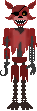

  

A 2D Open Source FNaF fan-game! 

# Built with
1. [Freebasic](https://www.freebasic.net/) - The BASIC Dialect i use
2. [WinAPI] - The normal Microsoft Windows Application Programming Interface

# What The Heck?! FREEBASIC?
Even though FreeBASIC isn't so popular like languages like Java, VB(.NET) or Python, Freebasic **IS** a very powerful language and has compatibility with C/C++ Libraries. And yes, i will defend it with my life.

## How to Contribute
Pull requests are welcome. For major changes, please open an issue first to discuss what you would like to change. Please make sure to update tests as appropriate. If you'd like to contribute, please fork the repository and make changes as you'd like. Pull requests are warmly welcome.

Steps to contribute:
1. Fork this repository (link to your repository)
2. Create your feature branch (git checkout -b feature/fooBar)
3. Commit your changes (git commit -am 'Add some fooBar')
4. Push to the branch (git push origin feature/fooBar)
5. Create a new Pull Request

# Credits
The resources i used:
1. [Microsoft Docs] (https://docs.microsoft.com/)
2. [Freebasic Docs] (https://www.freebasic.net/)
3. [Stack Overflow] (https://stackoverflow.com/)
 
Special Thanks to Scott Cawthon for making FNaF series
